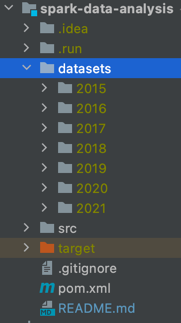
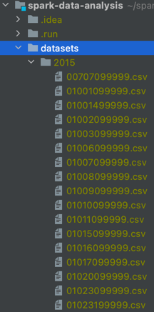

# Data Analysis Using Apache Spark

## Datasets
To be able to use this app you need to download the datasets from o *National Climactic Data Center* (NCDC) available in this link https://data.nodc.noaa.gov/cgi-bin/iso?id=gov.noaa.ncdc:C00516

After downloading the data add a folder *datasets* in the root folder of this project. The *datasets* folder must contain the decrompressed data separated by year, each year folder should containt the *.csv* files of the years' data.

Examples:
- 
- 

## How to run
>To run this project it is required that you have maven installed.
To check if it is installed run the command:
`mvn --version`
If it is not installed you can see how to install it [here](https://maven.apache.org/install.html).

1. Build the project
```bash
mvn package
```

2. Export Spark Driver address
```bash
export SPARK_LOCAL_IP="127.0.0.1"
```

3. Compile and run
```bash
mvn clean compile exec:java
```

You're good to go!

First thing you need to do is select the years of the data you want to analyse, they should match the folder names inside the *datasets* folder.

Then, write a command and type enter.
If you type "help" a list of all available commands will be displayed.